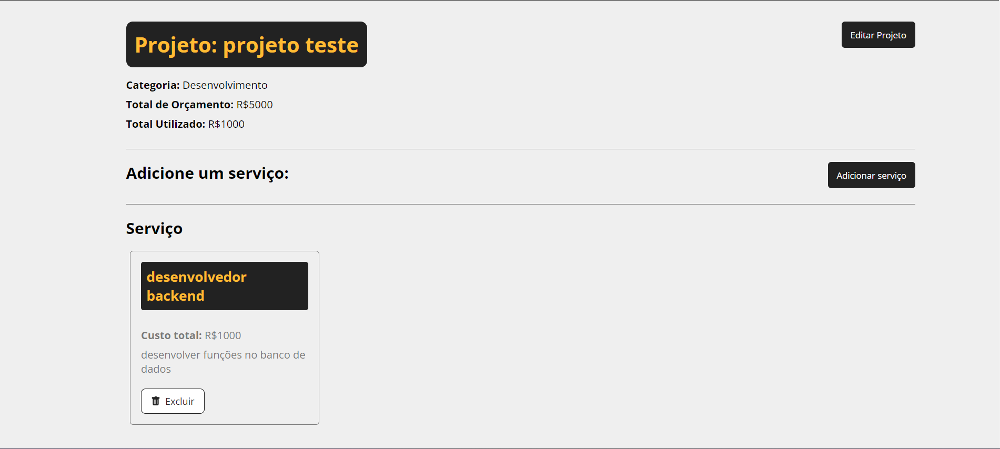

Gerenciador de Projetos Pessoais

Descrição: Este é um aplicativo desenvolvido com React que utiliza JSON Server como banco de dados para gerenciar informações cruciais sobre seus projetos pessoais. A aplicação foi projetada para simplificar a administração de custos, orçamentos, serviços e detalhes relacionados aos seus projetos, oferecendo uma solução prática e intuitiva para organizar e acompanhar seu progresso.

Funcionalidades:

Gerenciamento de Custos: Acompanhe e registre todos os custos associados aos seus projetos, garantindo uma visão clara e detalhada de suas despesas.
Controle de Orçamentos: Defina, monitore e ajuste orçamentos para cada projeto, ajudando a manter suas finanças sob controle.
Registro de Serviços: Mantenha um registro dos serviços contratados, incluindo detalhes importantes e históricos de transações.
Detalhes dos Projetos: Armazene e visualize informações detalhadas sobre cada projeto, permitindo um acompanhamento completo e organizado.
Tecnologias Utilizadas:

React: Framework para a construção da interface de usuário, proporcionando uma experiência interativa e responsiva.
JSON Server: Ferramenta para simular uma API RESTful com um banco de dados JSON, facilitando a gestão de dados e a realização de operações CRUD (Criar, Ler, Atualizar, Excluir).

link: https://costs-app-six.vercel.app/
